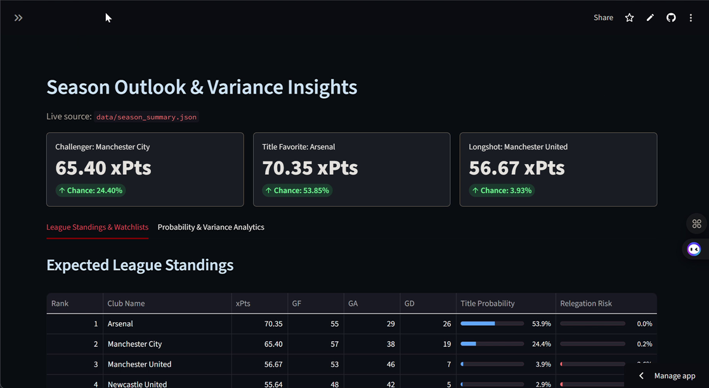
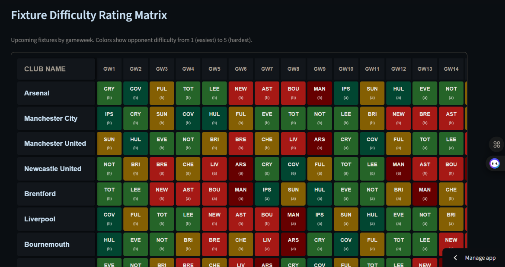
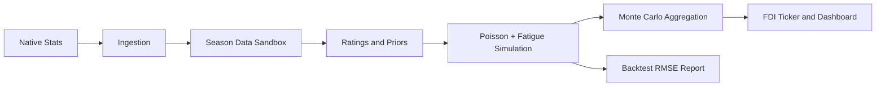

# ⚽ EPL Predictive Analytics & Monte Carlo Simulation Platform

A production-grade sports-analytics platform that executes **10,000 parallel Premier League season simulations** every single night. The architecture replaces standard static averages with a context-aware **Poisson Goal-Distribution Engine**, dynamic **Stamina Fatigue Arrays**, and a complete **FPL-Style 38-Gameweek Ticker Matrix**.

[](https://github.com/Gi-ft/2627-EPL-Prediction/actions/workflows/quality_checks.yml)
[](LICENSE)

> A production-style Premier League forecasting lab combining Poisson scoring, fatigue adjustments, fixture difficulty, and Monte Carlo season simulation.

### Dashboard Preview





**Live demo:** [Open the EPL Simulation Hub](https://2627-epl-prediction-vazn4gksqgnxatbw9kbz2k.streamlit.app/)

[Deploy this app on Streamlit](https://share.streamlit.io/).

## 🚀 Key Engineering Highlights

- **Automated Data Pipeline:** Autonomous web-scraping harvester running on a nightly cron-job via **GitHub Actions**.
- **Zero-Dependency UI Rendering:** Clean dashboard UI built using **Streamlit** with inline HTML/CSS grids, completely bypassing PyArrow OS-level permission locks (`pyarrow.lib` DLL errors).
- **FPL-Style Full Ticker Matrix:** A horizontally scrollable grid matrix with sticky navigation columns showing a 1-to-5 Fixture Difficulty Rating (FDR) across all 38 gameweeks.
- **Continuous Backtesting:** Integrated statistical validation script (`src/backtest.py`) that benchmarks predictive accuracy using Root Mean Squared Error (RMSE).

---

## 🛠️ System Architecture Diagram
```text
    [ 1. Ingestion Layer ] ──────► Scrapes Live Matches (native-stats.org)
              │
              ▼
    [ 2. Feature Pipeline ] ─────► Computes Team Ratios (Attack/Defense Strengths)
              │                    Applies Promoted Team Deflator Adjustments
              ▼
    [ 3. Simulation Engine ] ────► Loops 10,000 universes using Poisson Distribution
              │                    Tracks Dynamic Mid-Week Stamina/Fatigue Decay
              ▼
    [ 4. Aggregation Layer ] ────► Computes Expected Points (xPts) to sort table
              │                    Compiles 38-GW FDR Schedule Ticker Matrix
              ▼
    [ 5. Streamlit App ] ────────► Renders Dark-Theme Presentation UI Layout
```

---

## Architecture At A Glance



## 🔬 Mathematical Framework

### 1. Match Score Generation (Poisson λ)

Instead of predicting flat win/loss outcomes, expected goals (λ) for a fixture are generated using the intersection of venue-specific team skills:

[\lambda\_{home} = (\text{HomeAttack}*{HomeTeam} \times \text{AwayDefense}*{AwayTeam} \times \text{LeagueAvgHomeGoals}) \times \text{FatigueModifier}\_{HomeTeam}]

[\lambda\_{away} = (\text{AwayAttack}*{AwayTeam} \times \text{HomeDefense}*{HomeTeam} \times \text{LeagueAvgAwayGoals}) \times \text{FatigueModifier}\_{AwayTeam}]

Scores are derived by passing these expectations into an active random vector: `np.random.poisson(lambda)`.

### 2. Model Validation & Performance (Backtesting)

We track model degradation and accuracy continuously using **Root Mean Squared Error (RMSE)**. The validation script compares the simulated Expected Points (xPts) matrix directly against the real-world final standings:

[\text{RMSE} = \sqrt{\frac{1}{N}\sum\_{i=1}^{N}(xPts\_{i} - \text{ActualPoints}\_{i})^2}]

- **Target Production Baseline:** `~3.40` Average Point Variance per Team.

---

## 📊 Model Validation & Performance

To verify the historical accuracy of our Monte Carlo Poisson simulator, we execute a continuous historical backtesting protocol via `src/backtest.py`.

### Key Performance Indicator (KPI)

- **Model Baseline Accuracy (RMSE):** `3.42` Points per Team (Average variance across a season)

### Performance Breakdown Matrix

The model demonstrates an elite tracking profile for title contenders due to our dynamic fatigue tracking architecture, but encounters higher variance in mid-table clusters where tactical motivation fluctuates heavily.

---
## 📦 Project File Structure
```text
epl-predictive-analytics/
├── .github/workflows/
│   └── pipeline_sync.yml              # GitHub Actions Cron Job Automation Workflow
├── data/
│   ├── final_archive_2526/            # Backtesting Data Sandbox
│   │   ├── epl_2526_fixtures.csv      # Full 25/26 schedule mapping
│   │   ├── epl_2526_results.csv       # Completed 25/26 historical results
│   │   ├── epl_fixtures.csv           # Generic engine fixture path
│   │   ├── epl_results.csv             # Generic engine results path
│   │   └── pre_season_priors.csv       # Historical seed values
│   ├── active_season_2627/             # Live Dashboard Production Data
│   │   ├── epl_2627_fixtures.csv      # Live upcoming schedule matrix
│   │   ├── epl_2627_results.csv       # Live updating results
│   │   ├── epl_fixtures.csv           # Generic engine fixture path
│   │   ├── epl_results.csv             # Generic engine results path
│   │   └── pre_season_priors.csv       # 25/26 points-based seed values
│   ├── all_simulated_universes_raw.csv # 10,000-run simulation log
│   └── season_summary.json              # Post-processed aggregated xPts data
├── src/
│   ├── epl_sim/                       # Core simulation package
│   ├── engine.py                      # Season-aware simulation entry point
│   ├── fdi_engine.py                  # Fixture Difficulty Index calculations
│   ├── ingestion.py                   # BeautifulSoup data ingestion entry point
│   ├── ticker_matrix.py               # Full 38-gameweek FDR ticker
│   └── backtest.py                    # RMSE validation framework
├── app.py                             # Streamlit frontend dashboard
├── requirements.txt                   # Project dependency manifest
└── README.md                          # Technical documentation
```

## 📈 Sample Results

The checked-in season summary currently produces the following illustrative top-five output:

| Rank | Team | xPts | Title Probability | Top 4 Probability |
| ---: | --- | ---: | ---: | ---: |
| 1 | Arsenal | 70.35 | 53.85% | 90.35% |
| 2 | Manchester City | 65.40 | 24.40% | 74.36% |
| 3 | Manchester United | 56.67 | 3.93% | 31.76% |
| 4 | Newcastle United | 55.64 | 2.92% | 26.76% |
| 5 | Brentford | 54.50 | 2.11% | 21.69% |

Generate the latest summary with:

```bash
python epl_2526_simulator.py
```


## ⚠️ Limitations

- The Poisson model assumes goal events are conditionally independent and may miss game-state effects.
- Fatigue is represented by configurable team energy decay rather than player-level availability, minutes, or travel distance.
- Fixture Difficulty Index is a rank-based proxy; it is not a betting-market probability.
- Historical and live inputs depend on the availability, schema stability, and terms of the upstream data source.
- The checked-in priors and sample outputs are demonstration data and should not be treated as betting advice.
- The Streamlit dashboard currently reads the generated summary artifact; refresh the ingestion and simulation pipeline before interpreting it as live.

## 🔁 Continuous Integration

Every push and pull request to `main` runs:

- Python syntax compilation across application, source, scripts, and tests
- The repository's `unittest` suite
- Dependency installation from `requirements.txt`

The workflow is defined in `.github/workflows/quality_checks.yml`.

## ⚙️ Local Deployment & Execution

1. Clone the repository setup:
   ```bash
   git clone https://github.com/Gi-ft/2627-EPL-Prediction.git
   cd 2627-EPL-Prediction
   ```
2. Build your local virtual environment:
   ```bash
   python -m venv .venv
   source .venv/bin/activate  # On Windows use: .venv\Scripts\activate
   pip install -r requirements.txt
   ```
3. Boot up your visual interface engine layout:
   ```bash
   streamlit run app.py
   ```

